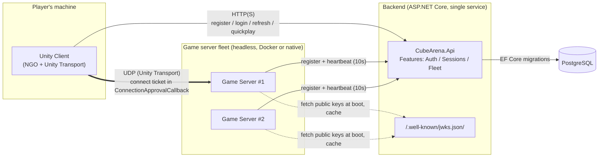

# Cube Arena

A 4-player multiplayer prototype built to exercise real infrastructure —
authoritative netcode, custom auth, signed connect tickets, and a real
dedicated-server fleet — with deliberately minimal gameplay on top. See
`CUBE_ARENA_PROMPT.md` for the original brief this project follows.

**The plumbing is the deliverable, not the game.** Combat, scoring, chat,
and persistence of match results are explicitly out of scope.

## Contents

- [What it is](#what-it-is)
- [Architecture](#architecture)
- [Design decisions worth knowing](#design-decisions-worth-knowing)
- [Gameplay](#gameplay)
- [Repo layout](#repo-layout)
- [How to run it](#how-to-run-it)
- [How to play](#how-to-play)
- [Testing](#testing)
- [Further reading](#further-reading)

## What it is

Four players register an account, log in, and click "Quick Play." The
backend finds (or spins up) a session with a free slot, issues each player
a short-lived signed ticket, and hands back the address of a real dedicated
game server process. The client connects to that server over UDP; the
server is the sole authority over every player's position. Players see each
other as coloured cubes (red/blue/green/yellow, one per slot) moving around
a small arena, with a minimap in the corner.

There is no host-client mode anywhere in this project — even for local
development, a separate headless server process is what every client
actually connects to.

## Architecture



Key property: **the client never talks to the database or holds any
signing key.** The game server never talks to the database and never holds
the private signing key — only the public JWKS material, fetched once at
boot. Full component diagram, sequence diagram, and threat model:
[`docs/ARCHITECTURE.md`](docs/ARCHITECTURE.md).

### Backend API surface

| Endpoint | Purpose |
|---|---|
| `POST /auth/register` | Create an account (email + password, Argon2id-hashed) |
| `POST /auth/login` | Returns a 15-minute access token (JWT) + 30-day refresh token |
| `POST /auth/refresh` | Rotates the refresh token; replay of an already-used token revokes the whole family |
| `POST /auth/logout` | Revokes the current refresh token family |
| `POST /sessions/quickplay` | Finds/allocates a session, reserves a slot, returns `{ host, port, sessionId, ticket, slotIndex }` |
| `GET /.well-known/jwks.json` | Public keys for offline ticket verification (fetched by game servers at boot) |
| `POST /fleet/register` | A game server registers itself on boot |
| `POST /fleet/heartbeat` | Game server reports player count every 10s |
| `POST /fleet/sessions/confirm` / `release` | Extends/releases a player's slot reservation on connect/disconnect (fleet-API-key protected) |

## Design decisions worth knowing

- **Connect tickets are asymmetrically signed (ES256).** The private key
  never leaves the backend; the game server fetches only the public key
  from `/.well-known/jwks.json` at boot. A ticket is `aud=gameserver`,
  `sid=<sessionId>`, `sub=<userId>`, `slot=<0..3>`, single-use `jti`,
  60-second expiry — verified entirely offline by the game server in
  `ConnectionApprovalCallback`, no round-trip to the backend needed per
  connection.
- **Movement is server-authoritative.** The client sends input intent only
  (a direction vector); the server simulates at a fixed 30Hz tick and
  writes the result to a server-owned `NetworkVariable`. The owning client
  predicts locally and soft-blends toward server truth to stay responsive
  without a full input-replay buffer — see
  [`docs/NETCODE.md`](docs/NETCODE.md) for exactly what was built and why
  a fuller reconciliation scheme wasn't needed here.
- **Crypto note (a real platform finding, not a design choice):**
  `System.Security.Cryptography`'s ECDsa/RSA APIs are non-functional on
  Unity's Mono runtime in a built player. Ticket verification on the game
  server uses BouncyCastle instead — see `docs/ARCHITECTURE.md`'s Phase 4
  findings before touching crypto or NGO connection code.
- **Netcode for GameObjects 2.13.2**, not 1.x — NGO 1.x doesn't compile
  against this Unity version.
- **Everything is built from code at runtime** (arena, player cubes, all
  UI) — there are no scene-authored GameObjects or hand-edited
  `.prefab`/`.unity` files. See `CLAUDE.md`.
- **Persistence is Postgres everywhere** (dev and prod), a deliberate
  simplification from the original brief's "SQLite for local dev," for
  dev/prod parity.

## Gameplay

Deliberately minimal, per the brief:

- **Arena**: a 40x40 flat plane with a boundary wall and static obstacle
  cubes.
- **Character**: a 1x1x1 body cube with a small "head" cube on top. No
  models, no animation.
- **Colours**: four fixed slots — red, blue, green, yellow — assigned by
  the server from the connect ticket's `slot` claim. The client only
  renders the assignment it's given.
- **Movement**: WASD, 5 m/s, server-authoritative at a 30Hz tick.
- **Minimap**: a top-down orthographic camera rendering the real arena to
  a `RenderTexture`, shown in a HUD corner — player cubes naturally appear
  as coloured dots from directly above.
- **Disconnect / rejoin**: a graceful leave, a timeout, or a clean
  process exit all release your slot after a short grace period; a
  rejoin within that window returns you to the same session and slot.

No combat, no scoring, no chat, no persistence of match results.

## Repo layout

```
CubeArena/                      # repo root == Unity project root
  Assets/
    Scripts/
      Shared/                   # netcode messages, constants, colours
      Client/                   # login UI, connect flow, movement client-side
      Server/                   # ServerBootstrap, ticket validation, fleet client
    Editor/BuildScript.cs       # batch-mode build entry points
  Packages/
  ProjectSettings/
  backend/
    CubeArena.Api/              # ASP.NET Core minimal API
      Features/Auth/
      Features/Sessions/
      Features/Fleet/
    CubeArena.Domain/
    CubeArena.Tests/
  infra/
    docker/                     # Dockerfile.api, Dockerfile.gameserver
    compose/                    # docker-compose.yml, .env, Tier 0 LAN scripts
  .github/workflows/
  docs/
    ARCHITECTURE.md             # component diagram, token/session sequence, threat model
    ROADMAP.md                  # phase-by-phase build history and scope notes
    NETCODE.md                  # prediction/reconciliation design
    HOSTING.md                  # all four hosting tiers, with runbooks
  SECURITY.md
```

## How to run it

Four tiers are documented in [`docs/HOSTING.md`](docs/HOSTING.md). **Tier 0
is the default** — everything on one machine, reachable by real clients on
your LAN (or, with [Tailscale](https://tailscale.com), by anyone regardless
of physical location) — no cloud account, no domain, no spending.

**Easiest**: double-click `infra/compose/Start-CubeArena-Host.bat` — brings
up the backend, builds the dedicated server if needed, and runs it, all in
one window.

Or manually, from `infra/compose/` (`.env` already has `PUBLIC_HOST`/
`LAN_MODE` set for this machine — see `.env.example` to set up elsewhere):

```powershell
docker compose up -d postgres api        # backend
.\run-gameserver-native.ps1               # dedicated server (native process)
.\print-connect-info.ps1                  # prints the connect string to hand players
```

To get a client for players to run (no Unity install needed on their end),
either build one locally with `.\package-client.ps1` (bakes in today's
connect string), or grab the one CI rebuilds on every push to `master`:
the [`latest-client` release](../../releases/tag/latest-client).

Tier 2 (a real internet-reachable deploy on a cloud VM, once the game is
worth deploying that far) and Tier 3 (managed/scaling sketch) are also
documented in `docs/HOSTING.md`, with a full copy-pasteable VM runbook for
Tier 2.

## How to play

1. Get the client (`Builds/CubeArena-Client.zip` from whoever's hosting, or
   build it yourself — see above).
2. Run `CubeArena.exe`.
3. On the login screen, paste the host's server address into the **"server
   address"** field (defaults to `http://localhost:8080` if left blank).
4. **Register** an account (any email/password), then **Log in**.
5. Pick a display name (cosmetic only) and click **Quick Play**.
6. WASD to move. The minimap in the corner shows every connected player as
   a coloured dot. **Leave** returns you to character select and frees your
   slot after a short grace period.

## Testing

- **Backend**: 55 unit + integration tests (`dotnet test backend/CubeArena.sln`)
  — token issuance/validation/expiry/rotation/reuse-detection, session
  allocation, ticket verification rejection paths (expired, wrong session,
  replayed `jti`, server full), fleet registration/heartbeat, confirm/release.
  Integration tests run against a real Postgres via Testcontainers; unit
  tests use EF Core InMemory + a fake time provider for deterministic
  expiry testing.
- **Client/netcode**: verified via live multi-client testing (documented in
  `docs/ROADMAP.md`'s per-phase notes) — real built clients and a real
  dedicated server, not simulated.
- CI: `.github/workflows/backend.yml` (build, test, image push to GHCR),
  `gameserver.yml` (GameCI Linux dedicated-server build, image push —
  skips cleanly rather than failing if `UNITY_LICENSE` isn't configured),
  `secret-scan.yml` (gitleaks).

## Further reading

- [`docs/ARCHITECTURE.md`](docs/ARCHITECTURE.md) — component diagram, full
  token/session sequence diagram, threat model, explicit out-of-scope list.
- [`docs/ROADMAP.md`](docs/ROADMAP.md) — phase-by-phase history, including
  every deliberate simplification and platform-compatibility finding made
  along the way.
- [`docs/NETCODE.md`](docs/NETCODE.md) — the prediction/reconciliation
  design in detail.
- [`docs/HOSTING.md`](docs/HOSTING.md) — all four hosting tiers, with
  concrete runbooks.
- [`SECURITY.md`](SECURITY.md) — identity/password handling, token and
  ticket design, fleet trust model, rate limiting, what's deliberately out
  of scope, and the `LAN_MODE` trust boundary.
- [`CLAUDE.md`](CLAUDE.md) — project conventions and hard rules (no
  host-client mode, no secrets in the client, code-built UI/arena, never
  hand-edit `.unity`/`.prefab`/`.meta` files).
