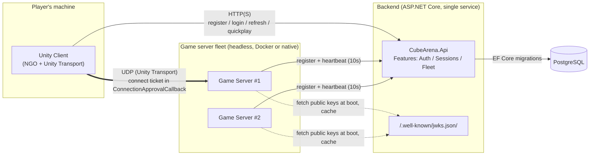

# Pocket Heist

*(formerly Cube Arena — see [Project history](#project-history))*

A 2-6 player co-op stealth heist: a crew of thumb-sized thieves sneaks into
a sleeping giant's kitchen, one night per run. Heavy loot needs several
thieves carrying it together, and teamwork makes noise — noise wakes the
giant. Built on real multiplayer infrastructure carried over from this
project's original prototype: authoritative netcode, custom auth, signed
connect tickets, and a real dedicated-server fleet.

See [`POCKET_HEIST_MASTER_PROMPT.md`](POCKET_HEIST_MASTER_PROMPT.md) for
the full pivot brief and [`docs/GAME_DESIGN.md`](docs/GAME_DESIGN.md) for
the living design reference (core loop, world scale, carry mechanics,
noise model, the giant's state machine).

## Contents

- [The idea](#the-idea)
- [Project status](#project-status)
- [Architecture](#architecture)
- [Design decisions worth knowing](#design-decisions-worth-knowing)
- [Repo layout](#repo-layout)
- [How to run it](#how-to-run-it)
- [Testing](#testing)
- [Project history](#project-history)
- [Further reading](#further-reading)

## The idea

**Core loop**: sneak in through a mousehole → find loot on/under the
kitchen table → carry it back to the mousehole → bank it as a team →
(later) spend earnings on gear → next night, a harder house.

- **World scale is ×25.** The giant's kitchen is built at real-world size;
  the thieves and everything they carry stay at native scale, so ordinary
  household objects — a chair, a table leg, a coin — read as genuinely
  enormous obstacles and payloads.
- **Loot needs multiple carriers.** Each item has a required carrier count;
  understaffed, it can only be dragged slowly and loudly. At full strength
  it moves at normal speed. Carrying is server-authoritative — the group
  moves as one, the server averages each carrier's input.
- **Noise wakes the giant.** A single server-side noise value drives his
  state machine: Asleep → Stirring (twitches, swats at nearby thieves) →
  Awake (phone-light search cone, catches anyone it holds on for 1.5s). A
  caught thief is trapped under an upturned glass until two free teammates
  tip it to free them.
- **The night ends at dawn** (or when everyone's caught) — unbanked loot is
  lost, banked loot counts toward the results screen.

There is no host-client mode anywhere in this project — even for local
development, a separate headless dedicated-server process is what every
client actually connects to; that hasn't changed from the original
prototype.

## Project status

Actively mid-build, in milestones, on the `pocket-heist` branch (merged to
`master` only once the full playable loop is done — see
[`AUTONOMOUS_RUN.md`](AUTONOMOUS_RUN.md) for the current build-out plan and
[`docs/PROGRESS.md`](docs/PROGRESS.md) for exactly what's done, what's next,
and known issues, kept up to date as the single source of truth for where
this stands right now).

| # | Milestone | Status |
|---|---|---|
| 1 | Asset import, placeholder characters, sleep pose | ✅ done |
| 2 | Kitchen greybox at scale, climbing mechanic, animated thief prefab | ✅ done |
| 3 | The coin test: 2-player carry, banking, team total | 🔧 in progress |
| 4 | Real kitchen assets, lighting pass, full loot set, all descent methods | ⏳ not started |
| 5 | Noise model, noise HUD, giant states and tells | ⏳ not started |
| 6 | Giant animations, catch/rescue, night timer, dawn, results screen | ⏳ not started |
| 7 | Proximity voice (evaluated separately, out of scope for now) | ⏳ not started |

Every design or technical trade-off made along the way is logged, with
reasoning, in [`docs/DECISIONS.md`](docs/DECISIONS.md); a manual playtest
checklist per finished milestone lives in
[`docs/PLAYTEST.md`](docs/PLAYTEST.md).

## Architecture



Key property: **the client never talks to the database or holds any
signing key.** The game server never talks to the database and never holds
the private signing key — only the public JWKS material, fetched once at
boot. Full component diagram, sequence diagram, and threat model:
[`docs/ARCHITECTURE.md`](docs/ARCHITECTURE.md). This whole layer — auth,
sessions, fleet, tickets — is unchanged by the Pocket Heist pivot; only the
gameplay built on top of it changed.

### Backend API surface

| Endpoint | Purpose |
|---|---|
| `POST /auth/register` | Create an account (email + password, Argon2id-hashed) |
| `POST /auth/login` | Returns a 15-minute access token (JWT) + 30-day refresh token |
| `POST /auth/refresh` | Rotates the refresh token; replay of an already-used token revokes the whole family |
| `POST /auth/logout` | Revokes the current refresh token family |
| `POST /sessions/quickplay` | Finds/allocates a session, reserves a slot, returns `{ host, port, sessionId, ticket, slotIndex }` |
| `GET /.well-known/jwks.json` | Public keys for offline ticket verification (fetched by game servers at boot) |
| `POST /fleet/register` | A game server registers itself on boot |
| `POST /fleet/heartbeat` | Game server reports player count every 10s |
| `POST /fleet/sessions/confirm` / `release` | Extends/releases a player's slot reservation on connect/disconnect (fleet-API-key protected) |

## Design decisions worth knowing

- **Connect tickets are asymmetrically signed (ES256).** The private key
  never leaves the backend; the game server fetches only the public key
  from `/.well-known/jwks.json` at boot. A ticket is `aud=gameserver`,
  `sid=<sessionId>`, `sub=<userId>`, `slot=<0..5>`, single-use `jti`,
  60-second expiry — verified entirely offline by the game server in
  `ConnectionApprovalCallback`, no round-trip to the backend needed per
  connection.
- **Player movement is server-authoritative,** hand-rolled rather than
  NGO's built-in `NetworkTransform`. The client sends input intent only; the
  server simulates at a fixed 30Hz tick and writes the result to a
  server-owned `NetworkVariable`. The owning client predicts locally and
  soft-blends toward server truth to stay responsive without a full
  input-replay buffer. Climbing (new for Pocket Heist) is a distinct
  movement mode on top of the same pipeline — gated by proximity to a
  `Climbable` marker, with no new input scheme. See
  [`docs/NETCODE.md`](docs/NETCODE.md).
- **Loot uses NGO's built-in `NetworkTransform`/`NetworkRigidbody`**
  instead of the hand-rolled pattern above — rigidbody state is meaningfully
  harder to hand-roll well than the simple kinematic player pose. Authority
  stays permanently server-side (unlike single-player-owned physics props),
  so 2-5 simultaneous carriers can grip the same item at once — full
  writeup in [`docs/NETCODE.md`](docs/NETCODE.md).
- **Crypto note (a real platform finding, not a design choice):**
  `System.Security.Cryptography`'s ECDsa/RSA APIs are non-functional on
  Unity's Mono runtime in a built player. Ticket verification on the game
  server uses BouncyCastle instead — see `docs/ARCHITECTURE.md`'s Phase 4
  findings before touching crypto or NGO connection code.
- **Netcode for GameObjects 2.13.2**, not 1.x — NGO 1.x doesn't compile
  against this Unity version.
- **Imported assets, prefabs, and scenes are allowed and expected** (a
  deliberate reversal from the original prototype's "everything built from
  code" rule, made for this pivot — see `CLAUDE.md`). Hand-editing
  `.unity`/`.prefab`/`.meta` files directly is still never allowed; Unity's
  own Editor/APIs own those files.
- **World scale is fixed at ×25** for the environment and the giant;
  thieves and loot physics stay at native scale so Unity physics behaves
  sensibly. See `docs/GAME_DESIGN.md` section 2 for the full conversion
  table.
- **Persistence is Postgres everywhere** (dev and prod), a deliberate
  simplification from the original brief's "SQLite for local dev," for
  dev/prod parity.

## Repo layout

```
CubeArena/                      # repo root == Unity project root (name predates the pivot)
  Assets/
    Scripts/
      Shared/                   # netcode messages, constants, colours
        PlayerController.cs     # movement, climbing, animation state, replication
        KitchenBuilder.cs       # "The Midnight Snacker" level greybox at x25 scale
        LootItem.cs             # server-authoritative multi-carrier loot (Milestone 3)
        MatchManager.cs         # match clock / team loot total
        Climbable.cs            # marker component for climbable surfaces
        SurfaceType.cs          # tile/rug tags for the noise model (Milestone 5)
        Tuning/                 # ScriptableObject tunables (climb, loot, animation)
      Client/                   # login UI, connect flow, HUD, scripted bot mode for testing
      Server/                   # ServerBootstrap, ticket validation, fleet client
    Editor/PocketHeist/         # batch-mode build/asset-generation tooling
    Editor/BuildScript.cs       # batch-mode build entry points
    ThirdParty/                 # imported CC0 asset packs — see docs/ASSETS.md
    Resources/                  # runtime-loaded prefabs and generated ScriptableObject assets
  Packages/
  ProjectSettings/
  backend/
    CubeArena.Api/              # ASP.NET Core minimal API
      Features/Auth/
      Features/Sessions/
      Features/Fleet/
    CubeArena.Domain/
    CubeArena.Tests/
  infra/
    docker/                     # Dockerfile.api, Dockerfile.gameserver
    compose/                    # docker-compose.yml, .env, Tier 0 LAN scripts
  .github/workflows/
  docs/
    GAME_DESIGN.md              # Pocket Heist's living design reference
    PROGRESS.md                 # current milestone, what's done/next, known issues
    DECISIONS.md                # every design/technical trade-off made, with reasoning
    PLAYTEST.md                 # manual playtest checklist per milestone
    ASSETS.md                   # every imported asset pack, licence, and where it's used
    ARCHITECTURE.md             # component diagram, token/session sequence, threat model
    ROADMAP.md                  # original prototype's phase-by-phase build history
    NETCODE.md                  # prediction/reconciliation + loot-authority design
    HOSTING.md                  # all four hosting tiers, with runbooks
  POCKET_HEIST_MASTER_PROMPT.md # the pivot brief this project follows
  CUBE_ARENA_PROMPT.md          # original brief, kept as historical record
  SECURITY.md
```

## How to run it

Four tiers are documented in [`docs/HOSTING.md`](docs/HOSTING.md). **Tier 0
is the default** — everything on one machine, reachable by real clients on
your LAN (or, with [Tailscale](https://tailscale.com), by anyone regardless
of physical location) — no cloud account, no domain, no spending.

**Easiest**: double-click `infra/compose/Start-CubeArena-Host.bat` — brings
up the backend, builds the dedicated server if needed, and runs it, all in
one window.

Or manually, from `infra/compose/` (`.env` already has `PUBLIC_HOST`/
`LAN_MODE` set for this machine — see `.env.example` to set up elsewhere):

```powershell
docker compose up -d postgres api        # backend
.\run-gameserver-native.ps1               # dedicated server (native process)
.\print-connect-info.ps1                  # prints the connect string to hand players
```

To get a client for players to run (no Unity install needed on their end):
build one locally with `.\package-client.ps1` (drops a ready-to-run copy at
`Play/CubeArena.exe`, plus `Builds/CubeArena-Client.zip` to share, both with
today's connect string baked in); run `.\install-git-hooks.ps1` once so
`Play/`/the zip rebuild themselves automatically in the background on every
`git push`; or grab the one CI rebuilds on every push to `master`: the
[`latest-client` release](../../releases/tag/latest-client).

When you're done hosting: double-click `infra/compose/Stop-CubeArena-Host.bat`
(or `.\stop-host.ps1`) — stops the dedicated server and brings the backend
down with it. Closing just the server window on its own only disconnects
players; Postgres/the API keep running (and stay reachable on whatever's
forwarded) until this is run.

Playing with someone who isn't on your physical LAN, without a cloud VM: see
`docs/HOSTING.md`'s "Playing with people who aren't on your physical LAN"
section — either a [Tailscale](https://tailscale.com) mesh network (nothing
forwarded to the open internet, one small app for each remote player), or
plain router port forwarding (zero installs for players, but the backend
port becomes reachable by the open internet while it's up — `docs/HOSTING.md`
covers exactly what that does and doesn't expose).

Tier 2 (a real internet-reachable deploy on a cloud VM) and Tier 3
(managed/scaling sketch) are also documented in `docs/HOSTING.md`, with a
full copy-pasteable VM runbook for Tier 2.

The full playable heist loop (giant AI, catch/rescue, night timer, results
screen) isn't finished yet — see [Project status](#project-status). What
runs today is the kitchen level, movement, climbing, and (as Milestone 3
lands) the first loot/carry/banking loop.

## Testing

- **Backend**: unit + integration tests (`dotnet test backend/CubeArena.sln`,
  59 passing as of Milestone 2) — token issuance/validation/expiry/rotation/
  reuse-detection, session allocation, ticket verification rejection paths
  (expired, wrong session, replayed `jti`, server full), fleet
  registration/heartbeat, confirm/release. Integration tests run against a
  real Postgres via Testcontainers; unit tests use EF Core InMemory + a
  fake time provider for deterministic expiry testing. Re-verified green
  after every milestone.
- **Client/netcode**: verified via live multi-client testing — real built
  clients and a real dedicated server, not simulated, including scripted
  headless bot clients (`CUBEARENA_BOT_MODE`) that walk real routes (e.g.
  the mousehole → chair → table climb route) so new mechanics get a real
  server-log trace, not just a compile check. Visual/animation changes are
  additionally verified with real Play-mode screenshots from a live client,
  inspected directly. See `docs/PROGRESS.md` for the verification evidence
  behind each finished milestone.
- CI: `.github/workflows/backend.yml` (build, test, image push to GHCR),
  `gameserver.yml` (GameCI Linux dedicated-server build, image push —
  skips cleanly rather than failing if `UNITY_LICENSE` isn't configured),
  `secret-scan.yml` (gitleaks).

## Project history

This repo started as **Cube Arena**, a 6-player multiplayer prototype built
to exercise real infrastructure — authoritative netcode, custom auth,
signed connect tickets, a real dedicated-server fleet — with deliberately
minimal gameplay on top (coloured cubes, an obstacle course, gold pickups).
`CUBE_ARENA_PROMPT.md` is kept as the original brief, a historical record
of that prototype. Once the infrastructure was solid, the project pivoted
to a real game built on it: **Pocket Heist**. The backend, auth, ticketing,
fleet, and hosting layers carried over unchanged; the gameplay layer is
being replaced piece by piece — see `docs/GAME_DESIGN.md` section 11's
replace/reuse/remove table for exactly what stayed, what got retuned, and
what's being deleted.

## Further reading

- [`docs/GAME_DESIGN.md`](docs/GAME_DESIGN.md) — Pocket Heist's living
  design reference: core loop, world scale, carry mechanics, noise model,
  the giant's state machine, lighting direction.
- [`docs/PROGRESS.md`](docs/PROGRESS.md) — current milestone, what's done,
  what's next, known issues. The single source of truth for build status.
- [`docs/DECISIONS.md`](docs/DECISIONS.md) — every design/technical
  trade-off made along the way, with reasoning.
- [`docs/ARCHITECTURE.md`](docs/ARCHITECTURE.md) — component diagram, full
  token/session sequence diagram, threat model, explicit out-of-scope list.
- [`docs/NETCODE.md`](docs/NETCODE.md) — the prediction/reconciliation
  design and the multi-carrier loot authority model, in detail.
- [`docs/HOSTING.md`](docs/HOSTING.md) — all four hosting tiers, with
  concrete runbooks.
- [`docs/ASSETS.md`](docs/ASSETS.md) — every imported asset pack, licence,
  source, and where it's used.
- [`docs/ROADMAP.md`](docs/ROADMAP.md) — the original Cube Arena
  prototype's phase-by-phase build history.
- [`SECURITY.md`](SECURITY.md) — identity/password handling, token and
  ticket design, fleet trust model, rate limiting, what's deliberately out
  of scope, and the `LAN_MODE` trust boundary.
- [`CLAUDE.md`](CLAUDE.md) — project conventions and hard rules (no
  host-client mode, no secrets in the client, imported assets allowed but
  never hand-edited, world scale ×25).
