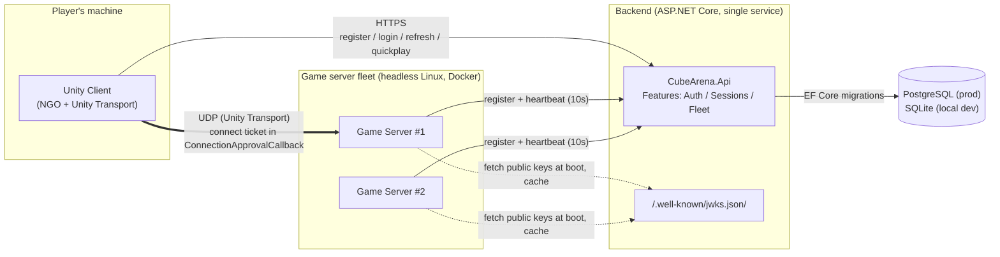

# Cube Arena — Architecture

## 0. Repo layout (adapted)

The brief assumes `cube-arena/unity/`. This repository puts the Unity project
at the repo root instead (it already existed there before this brief), with
backend/infra/docs as siblings of `Assets/`:

```
CubeArena/                      # repo root == Unity project root
  Assets/
    Scripts/
      Shared/                   # netcode messages, constants, enums
      Client/
      Server/
    Scenes/
  Packages/
  ProjectSettings/
  backend/
    CubeArena.Api/              # minimal API host
      Features/Auth/
      Features/Sessions/
      Features/Fleet/           # game-server registration + heartbeat
    CubeArena.Domain/
    CubeArena.Tests/
  infra/
    docker/                     # Dockerfile.api, Dockerfile.gameserver
    compose/docker-compose.yml
    scripts/
  .github/workflows/
  docs/
```

The Unity dedicated-server build target and the client build target share
this one project (`Assets/Scripts/Server` vs `Assets/Scripts/Client`, split
by `#if UNITY_SERVER` / build profile), per the brief's "same Unity project,
two build targets" rule.

## 1. Confirmed environment

| Item | Value |
|---|---|
| Unity | 6000.5.5f1 |
| Render pipeline | URP 17.5.0 |
| Input | Input System package 1.19.0 (new Input System) |
| Dev OS | Windows 10 Pro |
| Docker | Docker Desktop 27.2.0, Compose v2.29.2 |
| .NET SDK | 8.0.101 |
| Netcode packages | Not yet installed — added in Phase 4 (`com.unity.netcode.gameobjects`, `com.unity.transport`) |
| Auth model | Custom (hand-rolled users + refresh-token table), not ASP.NET Core Identity |
| Hosting target (near-term) | Local only, via `docker compose`, through Phase 6 |
| Source control | https://github.com/AlexBoyev/CubeArena |

A repo hygiene issue was found and fixed before Phase 0 work started: the
Unity `.gitignore`/`.gitattributes` had lost their leading dot on disk, so
git never applied them and the initial commit accidentally tracked 51k+
files under `Library/`, `Temp/`, `Logs/`, `UserSettings/`. Since nothing had
been pushed yet, this was fixed by renaming the files, untracking those
folders, and amending the single existing commit — history is clean from
the first push.

## 2. Component diagram



Key property: the client never talks to the DB or holds any signing key.
The game server never talks to the DB and never holds the private signing
key — only the public JWKS material, fetched once at boot.

## 3. Token & session lifecycle

```mermaid
sequenceDiagram
    participant C as Unity Client
    participant A as Backend API
    participant D as DB
    participant G as Game Server

    C->>A: POST /auth/register (email, password)
    A->>D: store user (Argon2id hash)
    A-->>C: 201 Created

    C->>A: POST /auth/login (email, password)
    A->>D: verify password hash
    A->>D: store new refresh token (hashed, family id)
    A-->>C: accessToken (JWT, 15m) + refreshToken (opaque, 30d)

    Note over G,A: at boot
    G->>A: GET /.well-known/jwks.json
    A-->>G: public keys (cached by G)

    C->>A: POST /sessions/quickplay (Bearer accessToken)
    A->>A: find session with <4 players, or allocate one
    A->>A: reserve slot, 60s expiry
    A-->>C: { host, port, sessionId, ticket, slotIndex }

    C->>G: UDP connect, ticket in ConnectionApprovalCallback payload
    G->>G: verify signature + exp (offline, public key only)
    G->>G: check aud=="gameserver" && sid==self
    G->>G: check jti not in local used-set; add it
    G->>G: check current players < 4
    alt all checks pass
        G-->>C: connection approved, slotIndex assigned
    else any check fails
        G-->>C: rejected + structured reason code
    end

    Note over C,A: access token expires after 15m
    C->>A: POST /auth/refresh (old refreshToken)
    A->>D: look up hash, check not already rotated
    alt token already used once (replay)
        A->>D: revoke entire token family
        A-->>C: 401, re-login required
    else valid, first use
        A->>D: mark old token rotated, store new one
        A-->>C: new accessToken + new refreshToken
    end

    C->>A: POST /auth/logout
    A->>D: revoke current refresh token family
    A-->>C: 204 No Content
```

## 4. Threat model

| Threat | Vector | Mitigation | Phase |
|---|---|---|---|
| Credential stuffing / brute force | Repeated `POST /auth/login` | Per-IP and per-account rate limiting, exponential-backoff lockout | 2 |
| Password DB compromise | DB breach / leaked backup | Argon2id hashing, no reversible storage | 2 |
| Refresh token theft & replay | Stolen token reused after it was already rotated | Rotate on every use; reuse of a rotated token revokes the whole family | 2 |
| Access token forgery | Attacker crafts a JWT | RS256/ES256 signature verification, 15 min expiry, `aud`/`iss` checks | 2/3 |
| Connect-ticket replay | Valid ticket reused to join twice or after expiry | One-time `jti` set per game-server process, 60s `exp` | 3/4 |
| Connect-ticket forgery | Attacker crafts their own ticket | Asymmetric signing; private key never leaves backend; game server holds only the public key via JWKS | 3 |
| Session/slot cross-wiring | Ticket for session A presented to server B | `sid` claim checked against the server's own session id | 4 |
| Client-side movement cheating | Modified client sends bogus position/speed | Server-authoritative simulation; client sends input intent only; server rejects implausible speed | 5 |
| ServerRpc abuse / player-id spoofing | Malicious or forged RPC payloads | Validate sender via NGO client id (never a client-supplied id), rate-limit and range-check every ServerRpc | 5 |
| Secrets embedded in client build | Decompiled Unity client binary | No secrets, keys, or connection strings ever shipped to the client; only public JWKS material reaches it | 3/4 |
| Backend traffic interception | Network MITM on HTTP(S) auth traffic | TLS on all backend endpoints; certificate pinning explicitly deferred (see below) | 7 |
| Game-server connection flooding | Attacker spams connection attempts | Ticket-gated `ConnectionApprovalCallback`, capacity check, structured rejection reasons | 4 |
| Stale/zombie fleet entries | Game server crashes without deregistering | Heartbeat every 10s; backend evicts entries after 3 missed heartbeats | 3/4 |
| Secret leakage via logs | Tokens/passwords logged accidentally | Structured JSON logs with correlation id; explicit rule to never log token or password material | 2 |
| Secret leakage via source control | `.env` or connection string committed | `.env.example` only, nothing secret committed, CI/pre-commit secret-pattern scan | 1 |

## 5. Out of scope for this prototype

- Combat, scoring, chat, and persistence of match results (explicitly excluded by the brief's gameplay scope).
- Matchmaking beyond quickplay's "join any session with a free slot, else allocate one."
- Spectator mode, replays, voice chat.
- Anti-cheat beyond server-authoritative simulation (no heuristic/ML cheat detection).
- Horizontal scaling or load balancing of the backend API itself.
- TLS certificate pinning (noted in the threat model as deferred, not solved).
- DDoS protection beyond basic per-IP/per-account rate limiting.
- Account recovery, email verification, or password-reset flows.
- Mobile/console client builds.
- Admin or moderation tooling, analytics/telemetry pipelines.
