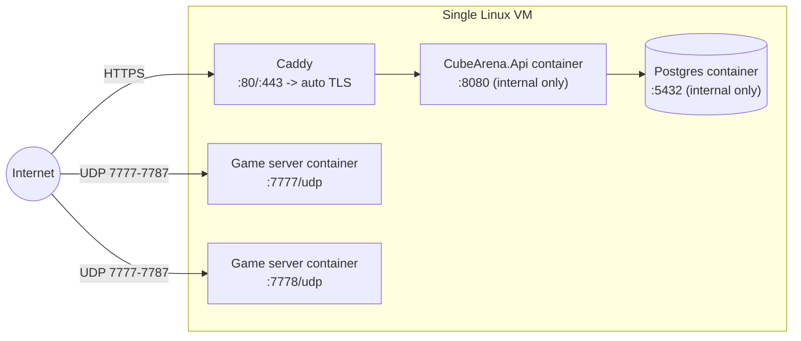

# Cube Arena — Hosting

Four tiers. Tier 0 is the **default development path** — everything on your
own PC, no cloud account, no domain, no spending — and doubles as a same-room
LAN party setup as-is. Tier 1 is plain `localhost`-only local dev (what every
phase so far was built and verified against before tier 0 added the LAN
pieces). Tier 2 is the concrete "reach it from a second machine over the
internet" deploy target for Phase 7, once the game is actually worth
deploying. Tier 3 is a sketch of where this would go if it ever needed to
scale past a handful of concurrent matches.

## Tier 0 — LAN (default dev path / LAN party)

The **full stack** — Postgres, the API, and the dedicated game server — runs
on one machine, reachable by real Unity clients on the same LAN. No cloud
VM, no domain needed.

Postgres and the API always run via `docker compose` (`infra/compose/`). The
dedicated game server has **two ways to run**, both documented below:

- **Native Windows process** (this machine's default — no extra credentials
  needed): built locally now that the Windows Dedicated Server Build Support
  module is installed, run directly via
  `infra/compose/run-gameserver-native.ps1`.
- **Docker image** (`docker compose --profile docker-gameserver up -d`):
  pulls the same image `gameserver.yml` pushes to GHCR in CI. Requires
  either a Linux host (to build `infra/docker/Dockerfile.gameserver`
  locally instead of pulling) or GHCR pull access — that package is
  currently **private**, so pulling it from a fresh machine needs either
  `docker login ghcr.io` with a token that has `read:packages`, or making
  the package public (GitHub → your profile → Packages →
  `cubearena-gameserver` → Package settings → Change visibility).

- **Cost**: $0.
- **Reachability**: `docker-compose.yml` maps both the API's TCP port and the
  game server's UDP port without binding to `127.0.0.1`, so Docker exposes
  them on the host machine's real network interface. Anyone on the *same
  LAN* can reach them directly at the host's LAN IP — no port forwarding
  needed, since port forwarding is only for traffic arriving from *outside*
  the router. Reaching it from *outside* the LAN (over the internet) is what
  tier 2 is for.
- **`PUBLIC_HOST`**: set in `.env` to your machine's LAN IP (find it with
  `ipconfig` on Windows or `ip addr` on Linux/macOS). This becomes the game
  server's `CUBEARENA_ADVERTISE_HOST` — the address the game server reports
  when it registers with the backend's fleet, which is exactly the `host`
  value `/sessions/quickplay` hands back to clients. No backend or ticket
  code changes — this is pure environment wiring, the same `AdvertiseHost`
  mechanism tier 2 already uses, just pointed at a LAN IP instead of a
  public domain.
- **`LAN_MODE`**: set to `true` in `.env` to make the API print a loud boot
  warning that it's intentionally reachable beyond `localhost` over plain
  HTTP. See `SECURITY.md`'s "LAN_MODE" section for exactly what that does
  and does not change, and why it's a deliberate trusted-network-only
  trade-off, not a bug.
- **Connect string**: after bringing the stack up, run
  `infra/compose/print-connect-info.ps1` — it prints your detected LAN
  IP(s), cross-checks them against `PUBLIC_HOST`, and prints the exact
  string to hand each player (paste into the client's login-screen "server
  address" field — no environment variables or rebuilds needed on their
  end).
- **One-click start**: `infra/compose/Start-CubeArena-Host.bat` — double-click
  it. It brings up Postgres + the API, builds the dedicated server if it
  hasn't been built yet, waits for the API to report healthy, prints the
  connect string, then runs the server in that same window (leave it open
  while hosting). This replaces steps 3-7 of the runbook below with one
  double-click. (Plain `.ps1` files don't run on double-click in Windows
  Explorer by default — that's what the `.bat` wrapper is for; `start-host.ps1`
  has the actual logic if you want to read or adapt it.)
- **One-click stop**: `infra/compose/Stop-CubeArena-Host.bat` — closing the
  server window (or Ctrl+C) only stops the game server and disconnects
  players; Postgres and the API keep running (and stay reachable on
  whatever ports are forwarded) until something explicitly brings them
  down. This double-click does that: stops the dedicated server if it's
  still running, then `docker compose down`. Run it whenever you're done
  hosting for the session — especially important if your router ports are
  forwarded to the open internet (see "Playing with people who aren't on
  your physical LAN" below), since that's the only way those ports actually
  stop being reachable.

### Tier 0 runbook: bring the stack up and connect four clients

1. **Find your LAN IP** (Windows): `ipconfig` → the `IPv4 Address` under
   your active adapter (Wi-Fi or Ethernet), e.g. `10.100.102.100`. On
   Linux/macOS: `ip addr` / `ifconfig`.
2. **Set `.env`** (`infra/compose/.env`, copied from `.env.example` if you
   don't have one yet):
   ```
   PUBLIC_HOST=<your LAN IP>
   LAN_MODE=true
   ```
   (leave `AUTH_SIGNING_KEY` / `TICKET_SIGNING_KEY_PEM` / `FLEET_API_KEY` as
   whatever you already generated for local dev — no need to regenerate
   them for a LAN party.)
3. **Bring Postgres + the API up**:
   ```bash
   cd infra/compose
   docker compose up -d --build postgres api
   ```
4. **Verify the API is up**: `curl http://localhost:8080/health/ready`
   should return `Healthy`. Check the loud `LAN_MODE` banner appeared:
   `docker compose logs api | grep -A3 "LAN_MODE is ON"`. Then confirm it's
   reachable on the LAN IP too, not just localhost:
   `curl http://<PUBLIC_HOST>:8080/health/ready`.
5. **Build the dedicated server once** (skip if `Builds/WindowsServer/`
   already exists and `Assets/`/`Packages/` haven't changed since):
   ```
   Unity.exe -batchmode -quit -projectPath <repo root> -executeMethod BuildScript.BuildWindowsDedicatedServer
   ```
   Requires the Windows Dedicated Server Build Support module (Unity Hub →
   install-modules → `windows-server`) — this machine originally didn't
   have it, so it was installed as part of setting this up.
6. **Run the game server**: `.\run-gameserver-native.ps1` (from
   `infra/compose/`) — reads `PUBLIC_HOST`/`FLEET_API_KEY` from `.env` and
   launches the built server, advertising your LAN IP. Leave this window
   open; it's your dedicated server process for the party.
   - **Windows Firewall**: the first time this runs, Windows may prompt to
     allow the app through the firewall for Private networks — allow it.
     If players still can't connect, add the rule explicitly (PowerShell,
     as Administrator): `New-NetFirewallRule -DisplayName "Cube Arena LAN" -Direction Inbound -Protocol UDP -LocalPort 7777 -Action Allow`.
   - *(Alternative: Docker image instead of a native build — see the note
     above. Once the GHCR package is public or you're on a Linux host, use
     `docker compose --profile docker-gameserver up -d gameserver` instead
     of steps 5-6.)*
7. **Print the connect string**: `.\print-connect-info.ps1` (from
   `infra/compose/`). Confirms your detected LAN IP matches `PUBLIC_HOST`
   and prints the exact address to hand to players.
8. **Verify the game server's UDP port is actually reachable** (not just
   from this machine): see the note below — do this once before a real LAN
   party, not every time.
9. **Connect clients**: run up to four instances of the Unity client
   (Editor Play mode for some, built `.exe` for others — mixing both is
   fine). On each one's login screen, paste the connect string from step 7
   into the "server address" field, register/log in with a distinct
   account per player, then Quick Play. Each should land in a different
   coloured slot in the same match.
10. **Package a client to hand to remote players.** Three ways to get it,
    pick whichever's more convenient:
    - **Locally, on demand**: `.\package-client.ps1` (from
      `infra/compose/`) builds the client fresh and drops it in two
      places: `Builds/CubeArena-Client.zip` (the one file to share) and
      `Play/CubeArena.exe` at the repo root, ready to double-click without
      unzipping anything — both include a `README.txt`/baked-in connect
      string pulled from `PUBLIC_HOST` in `.env` at package time.
    - **Locally, automatically**: after running
      `.\install-git-hooks.ps1` once (installs a `pre-push` hook — git
      never tracks `.git/hooks/` itself, so this is the one-time setup
      step), `Play/` and the zip rebuild themselves in the background on
      every `git push`, so they always match what's on `master`. Runs
      detached — never blocks or delays the push. If Unity's Editor
      happens to be open at push time the rebuild is skipped (not
      queued); check `infra/compose/package_client_hook.log` if `Play/`
      seems stale.
    - **From CI**: `.github/workflows/client.yml` rebuilds the client on
      every push to `master` and publishes it as the
      [`latest-client` GitHub release](../../releases/tag/latest-client) —
      no local Unity build needed at all. That zip doesn't know your
      `PUBLIC_HOST`, so tell players the server address separately (or drop
      a copy of `print-connect-info.ps1`'s output next to it).

    Share whichever zip however you like (USB stick, cloud storage link,
    the release link) — the recipient just unzips and runs
    `CubeArena.exe`, no Unity install needed on their end.
11. **Shut down** when done: `infra/compose/Stop-CubeArena-Host.bat`
    (double-click), or manually — close the game server window (`Ctrl+C`),
    then `docker compose down` (add `-v` only if you also want to wipe the
    Postgres volume, e.g. to reset all accounts).

**Verifying UDP reachability from the LAN, not just localhost**: a UDP port
being open to `127.0.0.1` doesn't guarantee it's open to the rest of the
LAN — the most common gap is the host OS's own firewall (Windows Defender
Firewall, by default, does *not* auto-allow inbound UDP to a port Docker
Desktop publishes). From a **second device** on the same LAN:
```bash
# Linux/macOS second device, replace with your PUBLIC_HOST/port:
nc -u -z -v <PUBLIC_HOST> 7777
```
If that hangs or is refused while everything works fine from the host
machine itself, it's almost always the Windows firewall, not Docker or the
game server — add an inbound rule for UDP 7777 (PowerShell, as
Administrator, on the host):
```powershell
New-NetFirewallRule -DisplayName "Cube Arena LAN" -Direction Inbound -Protocol UDP -LocalPort 7777 -Action Allow
```
The most reliable end-to-end check, though, is simply step 7 above from an
actual second machine's client — if a real player on the LAN connects and
moves, the UDP path is proven.

### Playing with people who aren't on your physical LAN

Tier 0 as described needs everyone on the same physical network. If some
players are elsewhere, the recommended option is still **not** a cloud VM
(that's tier 2, for once the game is worth deploying) — it's a mesh VPN
like [Tailscale](https://tailscale.com) (free for personal use):

1. Install Tailscale on your machine and each remote player's machine; sign
   in and join the same private network ("tailnet").
2. Set `PUBLIC_HOST` in `.env` to your machine's Tailscale IP (`100.x.x.x`
   — shown by `tailscale ip` or the Tailscale app) instead of your regular
   LAN IP, then bring the stack up as usual.
3. Everything else is identical — remote players paste the same connect
   string into the client, exactly as if they were on your LAN, because as
   far as the OS is concerned they now are.

This keeps the same trust model `LAN_MODE` already assumes (plain HTTP is
fine because the network is closed to outsiders) without exposing any port
on your home router to the public internet, and without dealing with your
home IP changing. Router port forwarding + dynamic DNS is the other classic
option, but it exposes your home network directly to the internet and
needs a dynamic-DNS hostname since home IPs aren't stable — Tailscale avoids
both problems for free.

## Tier 1 — Local (`localhost`-only)

The same `docker compose` stack as tier 0, minus the LAN-facing pieces
(`PUBLIC_HOST`, `LAN_MODE`, the game server service) — everything bound to
`127.0.0.1` only, not reachable from any other device even on the same LAN.
This is how Phases 0-6 were built and verified before tier 0 existed; tier 0
is a strict superset and is now the recommended default, so use this tier
only if you deliberately want the game server *not* running (e.g. testing
just the backend API in isolation).

- **Cost**: $0.

## Tier 2 — Single VM (the Phase 7 deploy target)

One small Linux VM runs the entire stack: Postgres, the backend API behind a
reverse proxy with automatic TLS, and one or more game server containers on
a fixed UDP port range.



### Cost estimate

| Item | Estimate |
|---|---|
| VM (1-2 vCPU, 2-4GB RAM — Hetzner CX22 / DigitalOcean Basic / Vultr equivalent) | ~$6-12/month |
| Domain name (for TLS — Let's Encrypt requires one) | ~$10-15/year, if you don't already have one |
| TLS certificates (Let's Encrypt via Caddy) | Free |
| **Total** | **~$7-13/month** |

### Firewall rules (explicit)

| Port | Protocol | Source | Purpose |
|---|---|---|---|
| 22 | TCP | Your admin IP only (not 0.0.0.0/0) | SSH |
| 80 | TCP | Any | HTTP, redirects to HTTPS + ACME challenge for cert issuance |
| 443 | TCP | Any | HTTPS to the backend API (via Caddy) |
| 7777-7787 | UDP | Any | Game server traffic (Unity Transport). A range, not a single port, so multiple concurrent game server containers can each bind their own port |
| Everything else | — | — | Deny inbound. Outbound unrestricted (Docker image pulls, cert renewal, npm/NuGet if building on-box) |

Postgres (5432) and the API's own internal port (8080) are **never** exposed
to the internet directly — only reachable from Caddy inside the VM's private
Docker network, matching how `infra/compose/docker-compose.yml` already
isolates them.

### Concrete deployment steps

1. **Provision the VM.** Any provider works; pick Ubuntu 24.04 LTS. Note its
   public IPv4 address.
2. **Point DNS at it.** Create an A record, e.g. `api.yourdomain.com -> <VM IP>`.
   Caddy's automatic TLS needs a real domain that resolves publicly — it
   can't issue a certificate for a bare IP.
3. **Harden and install.**
   ```bash
   ssh root@<VM IP>
   apt update && apt upgrade -y
   curl -fsSL https://get.docker.com | sh
   apt install -y ufw
   ufw default deny incoming
   ufw default allow outgoing
   ufw allow 22/tcp
   ufw allow 80/tcp
   ufw allow 443/tcp
   ufw allow 7777:7787/udp
   ufw enable
   ```
4. **Get the code onto the VM.**
   ```bash
   git clone https://github.com/AlexBoyev/CubeArena.git
   cd CubeArena/infra/compose
   ```
5. **Create a real `.env`** (never reuse the dev secrets from your machine):
   ```bash
   cp .env.example .env
   # Generate real values:
   #   AUTH_SIGNING_KEY:        openssl rand -base64 48
   #   FLEET_API_KEY:           openssl rand -base64 32
   #   TICKET_SIGNING_KEY_PEM:  openssl ecparam -name prime256v1 -genkey -noout
   #                            (paste with real newlines replaced by literal \n)
   #   POSTGRES_PASSWORD:       a real random password
   ```
6. **Add Caddy in front of the API.** Add a `caddy` service to
   `docker-compose.yml` (or a sibling compose file) with a `Caddyfile`:
   ```
   api.yourdomain.com {
       reverse_proxy api:8080
   }
   ```
   Caddy handles the ACME challenge and certificate renewal automatically —
   no manual `certbot` step needed.
7. **Bring the backend up:**
   ```bash
   docker compose up -d
   ```
   Verify: `curl https://api.yourdomain.com/health/ready` from your own
   machine should return `Healthy`.
8. **Run the game server.** `.github/workflows/gameserver.yml` builds the real
   Linux server via GameCI and pushes it to
   `ghcr.io/alexboyev/cubearena-gameserver:latest` on every push to `master`
   (needs `UNITY_LICENSE` etc. as repo secrets first — see the workflow's
   header comment). Pull that image directly, or build it yourself if you've
   installed the Linux Dedicated Server module locally (see `CLAUDE.md`):
   ```bash
   docker pull ghcr.io/alexboyev/cubearena-gameserver:latest
   # or: docker build -f infra/docker/Dockerfile.gameserver -t cubearena-gameserver .
   docker run -d --network compose_default \
     -p 7777:7777/udp \
     -e CUBEARENA_BACKEND_URL=http://api:8080 \
     -e CUBEARENA_FLEET_API_KEY=<same value as .env> \
     -e CUBEARENA_ADVERTISE_HOST=<VM public IP> \
     -e CUBEARENA_LISTEN_PORT=7777 \
     cubearena-gameserver
   ```
   Run additional containers on 7778, 7779, ... (within the 7777-7787 range)
   for more concurrent matches.
9. **Point the client at the real backend.** Set `CUBEARENA_BACKEND_URL` to
   `https://api.yourdomain.com` for any client build you hand out.
10. **Verify from a second physical machine**: run the client, register,
    login, quick-play, and confirm it connects to the game server over the
    public internet.

## Tier 3 — Managed

Backend on a PaaS; game servers on something built for holding a UDP port
open per instance.

**The key constraint, called out explicitly**: most HTTP-oriented PaaS
products (Heroku-style platforms, most "serverless container" offerings)
only route HTTP(S)/TCP traffic to your app — they do not forward arbitrary
UDP. That rules them out for the *game server* specifically, even though
they're a perfectly good fit for the *backend API* (which is pure HTTP).

- **Backend**: any container-friendly PaaS with a managed Postgres add-on —
  Fly.io, Railway, Render, or Azure App Service / AWS App Runner. Roughly
  $10-25/month for a small instance plus a small managed Postgres.
- **Game servers**, in increasing order of operational complexity:
  1. **A VM scale set** (Azure VMSS, AWS EC2 Auto Scaling Group) — each
     instance runs the same `Dockerfile.gameserver` image with a UDP port
     opened directly on the instance, same firewall model as tier 2 but with
     autoscaling. You still own the fleet-registration glue (already built
     in `backend/CubeArena.Api/Features/Fleet`).
  2. **Kubernetes with `hostPort`** — each game server Pod binds a UDP port
     directly on its Node (via `hostPort`, since a regular Kubernetes
     `Service` load-balancer typically can't multiplex UDP game traffic to
     the right Pod the way it can HTTP). Needs a real cluster (GKE/EKS/AKS)
     and meaningfully more operational overhead than a VM scale set for a
     project this size.
  3. **Unity Game Server Hosting (Multiplay)** — a managed service built
     specifically for this problem: it allocates dedicated server instances
     and handles the UDP port allocation for you. This project's own
     backend would keep owning auth/matchmaking (`/sessions/quickplay`)
     and just hand Multiplay the same Linux server build as an allocation
     target instead of a self-managed VM/K8s fleet. Pricing is
     usage/allocation-based — Unity's own console has current rates; budget
     is highly workload-dependent, so no single number is meaningful here.

For a 4-player prototype, tier 3 is very likely overkill — it's included so
the architecture doesn't paint itself into a corner if this ever needs to
scale, not because it's the recommended next step after tier 2.
