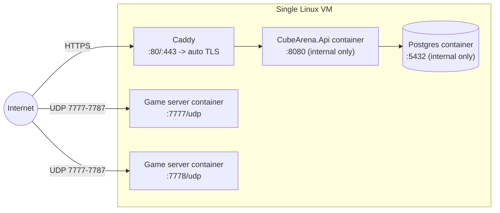

# Cube Arena — Hosting

Three tiers, per the brief's section 5. Tier 1 is what every phase of this
project has been developed and tested against; tier 2 is the concrete "reach
it from a second machine" deploy target for Phase 7; tier 3 is a sketch of
where this would go if it ever needed to scale past a handful of concurrent
matches.

## Tier 1 — Local

Everything on your own machine via `docker compose` (`infra/compose/`).
This is how every phase so far has been built and verified.

- **Cost**: $0.
- **Reachability**: `localhost` / `127.0.0.1` only. Not reachable from another
  machine, even on the same LAN, without additional port-forwarding you'd
  have to set up yourself (not covered here, since tier 2 is the intended
  path once you want that).

## Tier 2 — Single VM (the Phase 7 deploy target)

One small Linux VM runs the entire stack: Postgres, the backend API behind a
reverse proxy with automatic TLS, and one or more game server containers on
a fixed UDP port range.



### Cost estimate

| Item | Estimate |
|---|---|
| VM (1-2 vCPU, 2-4GB RAM — Hetzner CX22 / DigitalOcean Basic / Vultr equivalent) | ~$6-12/month |
| Domain name (for TLS — Let's Encrypt requires one) | ~$10-15/year, if you don't already have one |
| TLS certificates (Let's Encrypt via Caddy) | Free |
| **Total** | **~$7-13/month** |

### Firewall rules (explicit)

| Port | Protocol | Source | Purpose |
|---|---|---|---|
| 22 | TCP | Your admin IP only (not 0.0.0.0/0) | SSH |
| 80 | TCP | Any | HTTP, redirects to HTTPS + ACME challenge for cert issuance |
| 443 | TCP | Any | HTTPS to the backend API (via Caddy) |
| 7777-7787 | UDP | Any | Game server traffic (Unity Transport). A range, not a single port, so multiple concurrent game server containers can each bind their own port |
| Everything else | — | — | Deny inbound. Outbound unrestricted (Docker image pulls, cert renewal, npm/NuGet if building on-box) |

Postgres (5432) and the API's own internal port (8080) are **never** exposed
to the internet directly — only reachable from Caddy inside the VM's private
Docker network, matching how `infra/compose/docker-compose.yml` already
isolates them.

### Concrete deployment steps

1. **Provision the VM.** Any provider works; pick Ubuntu 24.04 LTS. Note its
   public IPv4 address.
2. **Point DNS at it.** Create an A record, e.g. `api.yourdomain.com -> <VM IP>`.
   Caddy's automatic TLS needs a real domain that resolves publicly — it
   can't issue a certificate for a bare IP.
3. **Harden and install.**
   ```bash
   ssh root@<VM IP>
   apt update && apt upgrade -y
   curl -fsSL https://get.docker.com | sh
   apt install -y ufw
   ufw default deny incoming
   ufw default allow outgoing
   ufw allow 22/tcp
   ufw allow 80/tcp
   ufw allow 443/tcp
   ufw allow 7777:7787/udp
   ufw enable
   ```
4. **Get the code onto the VM.**
   ```bash
   git clone https://github.com/AlexBoyev/CubeArena.git
   cd CubeArena/infra/compose
   ```
5. **Create a real `.env`** (never reuse the dev secrets from your machine):
   ```bash
   cp .env.example .env
   # Generate real values:
   #   AUTH_SIGNING_KEY:        openssl rand -base64 48
   #   FLEET_API_KEY:           openssl rand -base64 32
   #   TICKET_SIGNING_KEY_PEM:  openssl ecparam -name prime256v1 -genkey -noout
   #                            (paste with real newlines replaced by literal \n)
   #   POSTGRES_PASSWORD:       a real random password
   ```
6. **Add Caddy in front of the API.** Add a `caddy` service to
   `docker-compose.yml` (or a sibling compose file) with a `Caddyfile`:
   ```
   api.yourdomain.com {
       reverse_proxy api:8080
   }
   ```
   Caddy handles the ACME challenge and certificate renewal automatically —
   no manual `certbot` step needed.
7. **Bring the backend up:**
   ```bash
   docker compose up -d
   ```
   Verify: `curl https://api.yourdomain.com/health/ready` from your own
   machine should return `Healthy`.
8. **Run the game server.** `.github/workflows/gameserver.yml` builds the real
   Linux server via GameCI and pushes it to
   `ghcr.io/alexboyev/cubearena-gameserver:latest` on every push to `master`
   (needs `UNITY_LICENSE` etc. as repo secrets first — see the workflow's
   header comment). Pull that image directly, or build it yourself if you've
   installed the Linux Dedicated Server module locally (see `CLAUDE.md`):
   ```bash
   docker pull ghcr.io/alexboyev/cubearena-gameserver:latest
   # or: docker build -f infra/docker/Dockerfile.gameserver -t cubearena-gameserver .
   docker run -d --network compose_default \
     -p 7777:7777/udp \
     -e CUBEARENA_BACKEND_URL=http://api:8080 \
     -e CUBEARENA_FLEET_API_KEY=<same value as .env> \
     -e CUBEARENA_ADVERTISE_HOST=<VM public IP> \
     -e CUBEARENA_LISTEN_PORT=7777 \
     cubearena-gameserver
   ```
   Run additional containers on 7778, 7779, ... (within the 7777-7787 range)
   for more concurrent matches.
9. **Point the client at the real backend.** Set `CUBEARENA_BACKEND_URL` to
   `https://api.yourdomain.com` for any client build you hand out.
10. **Verify from a second physical machine**: run the client, register,
    login, quick-play, and confirm it connects to the game server over the
    public internet.

## Tier 3 — Managed

Backend on a PaaS; game servers on something built for holding a UDP port
open per instance.

**The key constraint, called out explicitly**: most HTTP-oriented PaaS
products (Heroku-style platforms, most "serverless container" offerings)
only route HTTP(S)/TCP traffic to your app — they do not forward arbitrary
UDP. That rules them out for the *game server* specifically, even though
they're a perfectly good fit for the *backend API* (which is pure HTTP).

- **Backend**: any container-friendly PaaS with a managed Postgres add-on —
  Fly.io, Railway, Render, or Azure App Service / AWS App Runner. Roughly
  $10-25/month for a small instance plus a small managed Postgres.
- **Game servers**, in increasing order of operational complexity:
  1. **A VM scale set** (Azure VMSS, AWS EC2 Auto Scaling Group) — each
     instance runs the same `Dockerfile.gameserver` image with a UDP port
     opened directly on the instance, same firewall model as tier 2 but with
     autoscaling. You still own the fleet-registration glue (already built
     in `backend/CubeArena.Api/Features/Fleet`).
  2. **Kubernetes with `hostPort`** — each game server Pod binds a UDP port
     directly on its Node (via `hostPort`, since a regular Kubernetes
     `Service` load-balancer typically can't multiplex UDP game traffic to
     the right Pod the way it can HTTP). Needs a real cluster (GKE/EKS/AKS)
     and meaningfully more operational overhead than a VM scale set for a
     project this size.
  3. **Unity Game Server Hosting (Multiplay)** — a managed service built
     specifically for this problem: it allocates dedicated server instances
     and handles the UDP port allocation for you. This project's own
     backend would keep owning auth/matchmaking (`/sessions/quickplay`)
     and just hand Multiplay the same Linux server build as an allocation
     target instead of a self-managed VM/K8s fleet. Pricing is
     usage/allocation-based — Unity's own console has current rates; budget
     is highly workload-dependent, so no single number is meaningful here.

For a 4-player prototype, tier 3 is very likely overkill — it's included so
the architecture doesn't paint itself into a corner if this ever needs to
scale, not because it's the recommended next step after tier 2.
